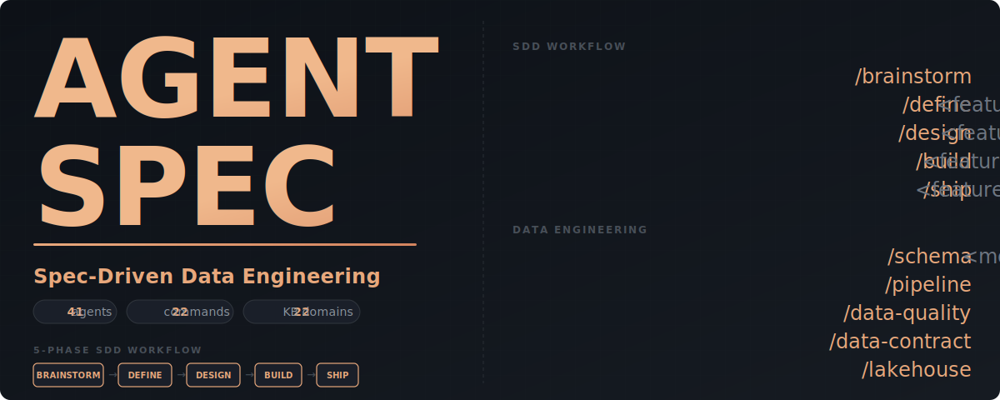

<div align="center">

<picture>
  <source media="(prefers-color-scheme: dark)" srcset="assets/banner.svg">
  <source media="(prefers-color-scheme: light)" srcset="assets/banner.svg">
  
</picture>

<br/>

[](LICENSE)
[](https://docs.anthropic.com/en/docs/claude-code)
[](CHANGELOG.md)
[](.claude/agents/)
[](.claude/kb/)

[Quick Start](#quick-start) | [Data Engineering](#data-engineering-commands) | [Documentation](docs/) | [Contributing](CONTRIBUTING.md)

</div>

---

## The Problem

Data engineering with AI assistants produces inconsistent results: hallucinated SQL, wrong partition strategies, missing quality checks, and pipelines that work in dev but break in production. Each conversation starts from scratch without accumulated domain knowledge.

## The Solution

AgentSpec brings **Spec-Driven Development (SDD)** to data engineering on Claude Code — a 5-phase workflow backed by 22 knowledge base domains, 58 specialized agents, and 21 slash commands:

```text
/brainstorm  →  /define  →  /design  →  /build  →  /ship
  (Explore)    (Capture)   (Architect)  (Execute)  (Archive)
                   │            │            │
              Data Contract  Pipeline    dbt build
              Schema SLAs    DAG Design  sqlfluff lint
              Source Inventory Partitions  GE suite run
```

Every phase now understands data engineering context: source inventories, freshness SLAs, schema contracts, partition strategies, and data quality gates.

---

## Quick Start

### Install

```bash
# Clone AgentSpec
git clone https://github.com/luanmorenommaciel/agentspec.git

# Copy the framework into your project
cp -r agentspec/.claude your-project/.claude
```

### Build Your First Data Pipeline

```bash
# 1. Explore the approach
claude> /brainstorm "Daily orders pipeline from Postgres to Snowflake star schema"

# 2. Capture requirements with data contracts
claude> /define ORDERS_PIPELINE

# 3. Design with pipeline architecture (DAG, partitions, incremental strategy)
claude> /design ORDERS_PIPELINE

# 4. Build with dbt + quality verification
claude> /build ORDERS_PIPELINE

# 5. Archive with lessons learned
claude> /ship ORDERS_PIPELINE
```

### Or Use Data Engineering Commands Directly

```bash
# Design a star schema
claude> /schema "Star schema for e-commerce analytics"

# Scaffold an Airflow DAG
claude> /pipeline "Daily orders ETL from Postgres to Snowflake"

# Generate quality checks
claude> /data-quality models/staging/stg_orders.sql

# Review SQL for anti-patterns
claude> /sql-review models/marts/

# Create a data contract
claude> /data-contract "Contract between orders team and analytics"

# Migrate legacy ETL
claude> /migrate legacy/etl_orders_proc.sql
```

---

## What You Get

### 5-Phase Workflow with Quality Gates

| Phase | Command | What It Does | Quality Gate |
|-------|---------|------|-------|
| **Brainstorm** | `/brainstorm` | Explore approaches, data flow sketches | 3+ questions, 2+ approaches |
| **Define** | `/define` | Requirements + data contracts, SLAs | Clarity Score >= 12/15 |
| **Design** | `/design` | Architecture + pipeline DAG, partitions | Complete manifest + schema plan |
| **Build** | `/build` | Execute + dbt build, sqlfluff, GE | All tests + quality gates pass |
| **Ship** | `/ship` | Archive with lessons learned | Acceptance verified |

### 41 Specialized Agents

| Category | Count | Examples |
|----------|-------|---------|
| **Workflow** | 6 | brainstorm, define, design, build, ship, iterate |
| **Code Quality** | 5 | code-reviewer (DE-aware), test-generator (GE/dbt), code-cleaner (SQL), python-developer |
| **Data Engineering** | 15 | dbt-specialist, spark-engineer, spark-troubleshooter, spark-performance-analyzer, pipeline-architect, schema-designer, sql-optimizer, streaming-engineer, lakehouse-architect, lakeflow-specialist, medallion-architect, data-quality-analyst, ai-data-engineer, data-platform-engineer, data-contracts-engineer |
| **Cloud Platforms** | 5 | aws-data-architect, aws-deployer, fabric-architect, fabric-pipeline-developer, gcp-data-architect |
| **AI/ML** | 2 | genai-architect, ai-prompt-specialist |
| **Dev** | 2 | overnight-builder, prompt-crafter |
| **Communication** | 4 | adaptive-explainer, linear-pm, meeting-analyst, the-planner |
| **Exploration** | 2 | codebase-explorer, kb-architect |

During `/build`, agents are automatically matched to tasks: dbt models go to `dbt-specialist`, Spark jobs to `spark-engineer`, Fabric notebooks to `fabric-pipeline-developer`, quality checks to `data-quality-analyst`.

### 22 Knowledge Base Domains

| Category | Domains |
|----------|---------|
| **Core DE** | `dbt`, `spark`, `sql-patterns`, `airflow`, `streaming` |
| **Data Design** | `data-modeling`, `data-quality`, `medallion` |
| **Infrastructure** | `lakehouse`, `lakeflow`, `cloud-platforms`, `terraform` |
| **Cloud Deep Dives** | `aws`, `gcp`, `microsoft-fabric` |
| **AI & Prompt** | `ai-data-engineering`, `modern-stack`, `genai`, `prompt-engineering` |
| **Foundations** | `pydantic`, `python`, `testing` |

### 22 Slash Commands

| Category | Commands |
|----------|----------|
| **Workflow** (7) | `/brainstorm`, `/define`, `/design`, `/build`, `/ship`, `/iterate`, `/create-pr` |
| **Data Engineering** (8) | `/pipeline`, `/schema`, `/data-quality`, `/lakehouse`, `/sql-review`, `/ai-pipeline`, `/data-contract`, `/migrate` |
| **Dev** (1) | `/dev` (AgentLoop — SDD-lite for quick tasks) |
| **Core** (4) | `/memory`, `/meeting`, `/sync-context`, `/readme-maker` |
| **Knowledge** (1) | `/create-kb` |
| **Review** (1) | `/review` |

---

## Data Engineering Commands

| Command | What It Does | Primary Agent |
|---------|-------------|---------------|
| `/pipeline` | Scaffold Airflow/Dagster DAGs | pipeline-architect |
| `/schema` | Design star schemas, Data Vault, SCD | schema-designer |
| `/data-quality` | Generate GE suites, dbt tests | data-quality-analyst |
| `/lakehouse` | Iceberg/Delta setup, catalog config | lakehouse-architect |
| `/sql-review` | SQL anti-patterns, PII detection | code-reviewer + sql-optimizer |
| `/ai-pipeline` | RAG, embeddings, feature stores | ai-data-engineer |
| `/data-contract` | ODCS contracts, SLAs | data-contracts-engineer |
| `/migrate` | Legacy ETL to modern stack | dbt-specialist + spark-engineer |

---

## How It Works

```text
┌──────────────┐     ┌──────────────┐     ┌──────────────┐
│  BRAINSTORM  │────▶│    DEFINE    │────▶│    DESIGN    │
│  Data Flow   │     │ Data Contract│     │ Pipeline Arch│
│  Sketch      │     │ Schema SLAs  │     │ DAG + Parts  │
└──────────────┘     └──────────────┘     └──────────────┘
                                               │
                     ┌─────────────────────────┼─────────────────────────┐
                     ▼                         ▼                         ▼
              ┌────────────┐           ┌────────────┐           ┌────────────┐
              │ dbt-spec   │           │ spark-eng  │           │ pipeline   │
              │ Models     │           │ Jobs       │           │ DAGs       │
              └─────┬──────┘           └─────┬──────┘           └─────┬──────┘
                    └────────────────────────┼─────────────────────────┘
                                             ▼
                                      ┌────────────┐
                                      │   BUILD    │
                                      │ dbt build  │
                                      │ sqlfluff   │
                                      │ GE suite   │
                                      └─────┬──────┘
                                             ▼
                                      ┌────────────┐
                                      │    SHIP    │
                                      │  Archive   │
                                      └────────────┘
```

**Agent matching example:** Your DESIGN doc specifies dbt staging models, a PySpark transformation job, and an Airflow DAG — AgentSpec automatically delegates to `dbt-specialist`, `spark-engineer`, and `pipeline-architect` respectively.

**Requirements changed?** Use `/iterate` to update any phase document with automatic cascade detection to downstream docs.

---

## Project Structure

```text
.claude/
├── agents/              # 58 specialized agents
│   ├── workflow/        # 6 SDD phase agents
│   ├── architect/       # 8 system-level design agents
│   ├── cloud/           # 10 AWS, GCP, CI/CD agents
│   ├── platform/        # 6 Microsoft Fabric agents
│   ├── python/          # 6 code quality + prompt agents
│   ├── test/            # 3 testing + data quality agents
│   ├── data-engineering/ # 15 DE implementation agents
│   └── dev/             # 4 developer productivity agents
│
├── commands/            # 21 slash commands
│   ├── workflow/        # SDD phases (7)
│   ├── data-engineering/ # DE commands (8)
│   ├── core/            # Utilities (4)
│   ├── knowledge/       # KB management (1)
│   └── review/          # Code review (1)
│
├── sdd/                 # SDD framework
│   ├── architecture/    # WORKFLOW_CONTRACTS.yaml
│   ├── templates/       # 5 phase templates (DE-aware)
│   ├── features/        # Active feature documents
│   ├── reports/         # Build reports
│   └── archive/         # Shipped features
│
├── kb/                  # Knowledge Base (22 domains)
│   ├── dbt/             # dbt patterns and concepts
│   ├── spark/           # PySpark, Spark SQL
│   ├── sql-patterns/    # SQL best practices
│   ├── airflow/         # DAG patterns
│   ├── streaming/       # Flink, Kafka, CDC
│   ├── data-modeling/   # Star schema, Data Vault, SCD
│   ├── data-quality/    # GE, Soda, observability
│   ├── lakehouse/       # Iceberg, Delta, catalogs
│   ├── cloud-platforms/ # Snowflake, Databricks, BigQuery
│   ├── ai-data-engineering/ # RAG, vector DBs, features
│   ├── modern-stack/    # DuckDB, Polars, SQLMesh
│   ├── aws/             # Lambda, S3, Glue, SAM
│   ├── gcp/             # Cloud Run, Pub/Sub, BigQuery
│   ├── microsoft-fabric/ # Lakehouse, Warehouse, Pipelines
│   ├── lakeflow/        # Databricks Lakeflow (DLT)
│   ├── medallion/       # Bronze/Silver/Gold layers
│   ├── prompt-engineering/ # Chain-of-thought, extraction
│   ├── genai/           # Multi-agent systems, guardrails
│   ├── pydantic/        # Validation, LLM output schemas
│   ├── python/          # Python patterns, idioms
│   ├── testing/         # pytest, CI testing
│   └── terraform/       # IaC modules, state
│
└── docs/                # Documentation
```

---

## Documentation

| Guide | Description |
|-------|-------------|
| [Getting Started](docs/getting-started/) | Install and build your first data pipeline |
| [Core Concepts](docs/concepts/) | SDD pillars through a data engineering lens |
| [Tutorials](docs/tutorials/) | dbt, star schema, data quality, Spark, streaming, RAG |
| [Reference](docs/reference/) | Full catalog: 27 agents, 20 commands, 11 KB domains |

---

## Contributing

We welcome contributions! See [CONTRIBUTING.md](CONTRIBUTING.md) for guidelines.

- **New Agents** — add specialized agents for your domain
- **KB Domains** — share knowledge base domains (dbt packages, platform patterns)
- **DE Commands** — new slash commands for data workflows
- **Bug Fixes** — help improve stability
- **Documentation** — clarify and expand docs

---

## License

MIT License — see [LICENSE](LICENSE) for details.

---

<div align="center">

**[Documentation](docs/) | [Contributing](CONTRIBUTING.md) | [Changelog](CHANGELOG.md)**

Built with [Claude Code](https://docs.anthropic.com/en/docs/claude-code)

</div>
